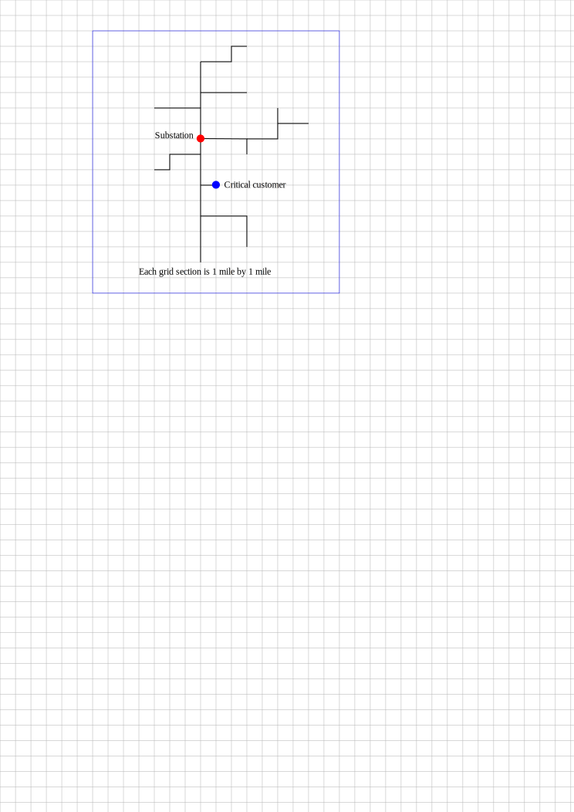

# 11. Voltage Sags and Momentary Interruptions

## Questions

1. An overhead circuit that uses fuse saving has 5 miles of mains and
   20 miles of total exposure. Annual line interruption rates are
   0.25/mile for permanent faults and 0.25/mile for temporary faults. The
   average annual momentary interruptions will be closest to which value?

   1. 2
   2. 5
   3. 10
   
2. Repeat for the same circuit with fuse blowing.

   1. 2
   2. 5
   3. 10
   
3. Which of the following are likely to ride through a 0.4-sec
   momentary interruption. Select all that apply.
   
   1. Computer workstation
   2. PLC controller
   3. Digital clock
   4. Adjustable-speed drive
   
4. For sags of 6 cycles or more, how much more frequent are sags to
   90% than are sags to 70%?
   
   1. 2X
   2. 1\.5X
   3. 1\.3X
   
5. For sags of 6 cycles or more, how much more frequent are sags to
   70% than are sags to 50%?

   1. 2X
   2. 1\.5X
   3. 1\.3X
   
0. Which PQ devices will help with sags? Mark all that apply.
   1. Dynamic voltage restorer (DVR)
   1. Static var compensator (SVC)
   1. Filter
   1. UPS
   1. Ferroresonant transformer
   1. Static transfer switch
   1. Mechanical transfer switch
   1. MOV

0. If you close a substation bus tie that is normally open, what will
   happen to the average frequency of voltage sags for customers fed
   by the substation?

   1. Voltage sag frequency will stay the same
   1. Voltage sag frequency will increase
   1. Voltage sag frequency will decrease

## Problems

1. For a line-to-ground fault 2 miles from the substation, what does
   the bus voltage drop to? 12.47-kV system, Ifault=7 kA at the
   substation

   - Repeat for a fault 4 miles from the substation.
   - Repeat for a three-phase fault.
   - Repeat for a 25-kV system (line-to-ground fault).
   
2. A PQ monitor shows a voltage sag that dropped to 50% of nominal for
   a line-to-ground fault. About how far was the fault from the
   substation? 34.5-kV system, Ifault=10 kA at the substation
   
3. Repeat for a 12.47-kV system with the same fault availability at
   the substation.

4. A critical customer is 4 miles from the substation. The customer is
   sensitive to sags that drop below 0.7 per unit. Draw an area of
   vulnerability marking the area of the circuit that can affect the
   customer. Estimate the number of events per year that could affect
   the customer. Assume the following:

   - 12\.47-kV
   - Ifault=7 kA at the substation
   - assume 1 ohm/mile of line impedance (line-to-ground faults)
   - 3 feeders fed from the station bus
   - fault rate = 0.5 faults/mile/year

   Here is the circuit showing three distribution circuits coming from
   one substation:

   

   Then, show the area of vulnerability for momentary interruptions.
   Estimate the number of momentary interruptions for this customer.

## Projects

0. Using OpenDSS or another short-circuit tool that can be scripted,
   write a script to implement the *fault positions method* of
   evaluating voltage sags. (Challenging)

